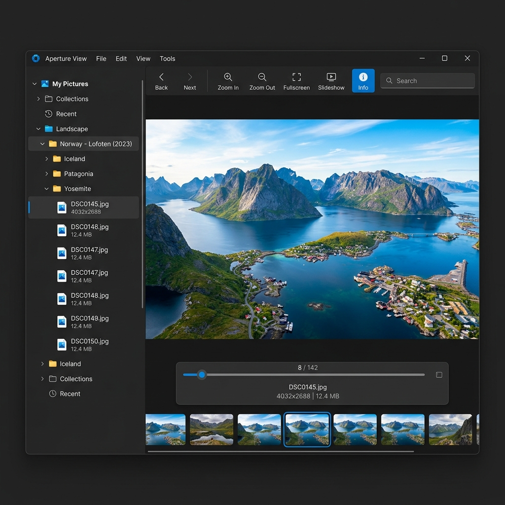

# プロジェクト概要



## 目的・背景

Windows 上で動作する高速な画像ビューアーアプリケーション。特定のフォルダを起点としたフォルダツリーを左パネルに表示し、選択フォルダの画像を右パネルで閲覧できる。マウス操作（サイドボタン・ホイール・ホバースライダー）で快適な画像ナビゲーションを提供する。

## スコープ

### 作るもの

- Windows デスクトップアプリ（Python + PyQt6）
- 左パネル：フォルダツリービュー（サブフォルダのみ表示、折りたたみ可能）
- 右パネル：画像ビューアー（フィット表示・ホイールズーム）
- マウスサイドボタンによる画像前後切り替え
- ビューアー下部ホバーで表示されるスライダー（複数画像時）
- 画像プリロードによる 100ms 以内の切り替えレスポンス

### 作らないもの

- 画像の編集・変換機能
- スライドショー機能
- 画像のメタデータ（EXIF）表示
- Windows 以外の OS 対応

## 技術スタック概要

| 技術 | 用途 | 選定理由 |
|------|------|----------|
| Python 3.10+ | アプリ本体 | 豊富なライブラリ・クロスプラットフォーム開発容易性 |
| PyQt6 | GUI フレームワーク | Windows ネイティブ風 UI・高速描画・マウスイベント完全対応 |
| Pillow | 画像読み込み・変換 | 幅広いフォーマット対応・PyQt6 との連携容易 |
| threading / QThreadPool | プリロード | バックグラウンドで隣接画像を先読みし切り替えを高速化 |

## 全体アーキテクチャ

```
MainWindow (QMainWindow)
├── QSplitter（左右分割）
│   ├── FolderTreePanel (QTreeView + QFileSystemModel)
│   │   └── サブフォルダのみフィルタリング
│   └── ImageViewerPanel (QWidget)
│       ├── ImageCanvas (QLabel / QPainter ベース)
│       │   └── マウスホイールズーム・サイドボタン処理
│       └── HoverSlider (QSlider, 下部ホバーで表示)
└── ImageCache（プリロードキャッシュ）
    └── QThreadPool でバックグラウンド読み込み
```

## 制約

- Windows 10/11 での動作を前提
- フォルダ切り替え時の読み込み時間は許容（数百ミリ秒程度）
- フォルダ内の前後切り替え・スライダー操作は 100ms 以内を目標
- 対応画像形式：JPEG, PNG, BMP, GIF（静止画のみ）, WEBP, TIFF

## UI デザイン方針

### コンセプト

ダークトーンでシンプルなフォトビューアー。余計な装飾を省き、画像に集中できる UI。

### カラーパレット

| 用途 | カラーコード | 説明 |
|------|-------------|------|
| プライマリ | #2196F3 | アクセント・選択状態 |
| 背景 | #1E1E1E | メイン背景 |
| パネル背景 | #252526 | サイドバー背景 |
| テキスト | #CCCCCC | 通常テキスト |
| スライダー | rgba(255,255,255,0.8) | 半透明オーバーレイ |

### タイポグラフィ

システムフォント（Segoe UI）を使用。

### コンポーネント方針

- スライダーはビューアー下部へのマウスホバーで表示、離れると非表示
- フォルダツリーは最小限のアイコンとテキストのみ
